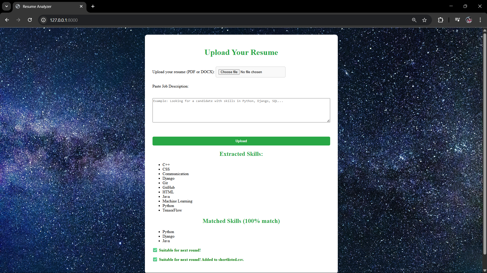

# 🧠 AI Resume Analyzer - LINK: https://ai-resume-analyzer-u76d.onrender.com/

A Django web application that allows users to upload resumes (PDF or DOCX), extracts skills using an AI model, and compares them with a provided Job Description (JD). If the resume matches the JD by 60% or more, it is shortlisted and exported to a CSV file.


##Demo Screenshots 


=======


---

## 🚀 Features

- 📤 Upload resume in `.pdf` or `.docx` format  
- 🧠 AI-powered skill extraction (NER using Hugging Face transformers)  
- 📋 Paste a job description to compare with extracted resume skills  
- ✅ Match % calculation and filtering  
- 📁 Auto-save shortlisted resumes to `shortlisted.csv`  
- 🌐 Responsive UI with basic CSS styling

---

## 🛠️ Technologies Used

- **Backend:** Python, Django
- **NLP:** spaCy, Hugging Face Transformers
- **Frontend:** HTML, CSS, JavaScript
- **Tools:** Git, GitHub, Render, Whitenoise
- **Other:** PyMuPDF, python-docx, CSV handling

---

## 📦 Installation

```bash
git clone https://github.com/sibiraj2003/resume-analyzer.git
cd resume-analyzer
pip install -r requirements.txt
python manage.py migrate
<<<<<<< HEAD
python manage.py runserver
=======
python manage.py runserver
>>>>>>> 549ff81 (update README before rebase)
